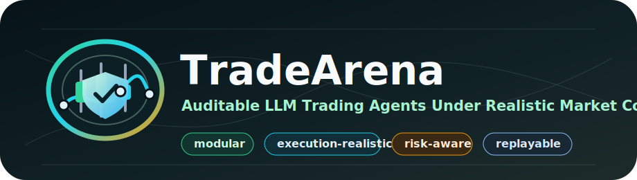
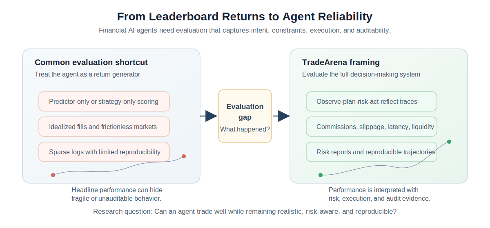
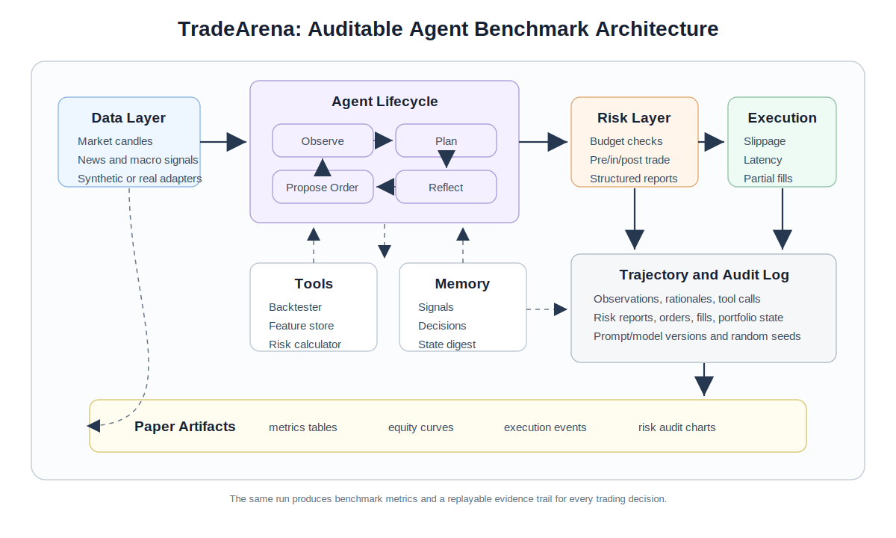

<p align="center">
  
</p>

<p align="center">
  <strong>Modular, execution-realistic, risk-aware benchmarks for LLM trading agents.</strong>
</p>

<p align="center">
  <a href="docs/getting_started.md">Getting started</a> |
  <a href="docs/demo_matrix.md">Demo matrix</a> |
  <a href="examples">Hands-on examples</a> |
  <a href="docs/schemas.md">Schemas</a> |
  <a href="docs/plugin_interfaces.md">Plugin interfaces</a>
</p>

<p align="center">
  
  
  
  
</p>

# TradeArena

TradeArena is a modular framework for studying trading agents as auditable
decision-making systems under realistic market constraints. It focuses on the
full lifecycle of a trading decision: observations, signals, intended weights,
risk-gate changes, orders, fills, slippage, rejected orders, memory events, and
replayable trajectory logs.

This public repository is the framework and demo release.



## One-Command Showcase

```bash
python -m pip install -e ".[dev]"
python scripts/run_showcase.py
```

Open:

```text
outputs/examples/showcase.html
```

The showcase is API-free. It builds a local portal linking to:

- an auditable trajectory report
- an execution-realism sweep
- A-share market-rule interventions
- Markowitz/MVO portfolio baselines
- a custom plugin extension example
- redacted LLM cache manifest metadata

## Quick Start

```bash
python -m pip install -e .
tradearena --benchmark tradearena-core
```

Without installing:

```powershell
$env:PYTHONPATH='src'
python -m trading_agent_os.cli --benchmark tradearena-core --periods 60 --symbols SYN,ALT
```

## Architecture

```text
Data Layer
  OHLCV market data, synthetic/proxy news and macro,
  optional CSV sidecars for news, macro, filings, and alternative data

Agent Layer
  analyst agents, strategy agents, risk managers, execution agents,
  portfolio managers

Tool Layer
  backtester, feature store, portfolio optimizer, risk calculator,
  realistic order simulator

Risk Layer
  RiskBudget, pre-trade gate, in-trade monitor, post-trade attribution,
  violation logging, structured RiskReport logs

Logging and Evaluation Layer
  trajectories, audit manifests, return metrics, risk metrics,
  behavioral metrics, execution realism metrics, reasoning consistency
```



## Hands-On Examples

```bash
python examples/quickstart_core_benchmark.py
python examples/audit_trajectory_walkthrough.py
python scripts/render_audit_report.py
python examples/execution_realism_sweep_demo.py
python examples/portfolio_markowitz_demo.py
python examples/custom_plugin_demo.py
```

See [`examples/README.md`](examples/README.md) and
[`docs/demo_matrix.md`](docs/demo_matrix.md) for the full demo map.

## Data Adapters

TradeArena's stable data boundary is normalized OHLCV CSV:

```text
Data source -> Date,Open,High,Low,Close,Volume CSV -> CsvMarketDataProvider
```

A-share data can be downloaded through the optional AkShare bridge:

```bash
python -m pip install -e ".[ashare]"
python scripts/download_akshare_ashare_daily.py --symbols 600519.SS,300750.SZ --start 2021-01-01 --end 2026-05-14 --output-dir data/real/akshare_ashare_daily
```

Then reuse the same benchmark stack:

```bash
python -m trading_agent_os.cli --benchmark tradearena-core --data-source csv --real-data-dir data/real/akshare_ashare_daily --symbols 600519.SS,300750.SZ --real-max-periods 80
```

## LLM And Cache Policy

Live model calls are optional. The API-free demos use deterministic agents,
tracked market data, and redacted cache manifests. If you run live model-backed
experiments, raw prompt/response JSONL caches are ignored by Git:

```text
data/llm_cache/*.jsonl
```

Build shareable redacted manifests with:

```bash
python scripts/build_llm_cache_manifest.py
```

## Contributing

Start with [`examples/custom_plugin_demo.py`](examples/custom_plugin_demo.py) if
you want to add a new analyst, strategy, risk gate, simulator, memory store, or
metric. See [`CONTRIBUTING.md`](CONTRIBUTING.md).

Before opening a pull request:

```bash
python -m compileall src scripts examples tests -q
python -m pytest tests -q
python scripts/run_showcase.py --reuse-existing
```

## Disclaimer

TradeArena is a research and engineering framework. It is not financial advice,
and it is not a live trading system.
