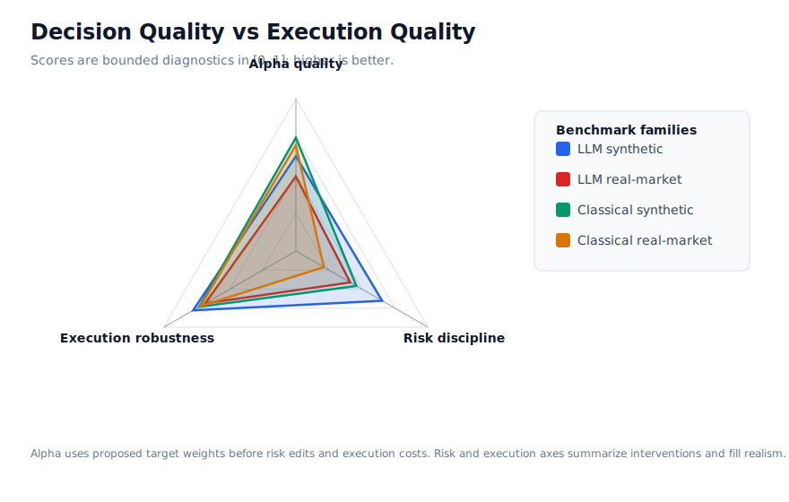

# Decision Quality vs Execution Quality

This diagnostic separates three axes that are easy to conflate in a single return table:

- Alpha quality: pre-risk, pre-cost intended allocation quality.
- Risk discipline: how often proposals survive the risk gate without clips, blocks, or violations.
- Execution robustness: how well approved orders survive fills, liquidity, latency, rejection, and cost.

| Family | Rows | Alpha quality | Risk discipline | Execution robustness | Pre-risk alpha return | Realized return | Worst DD | Fill rate | Risk edits | Violations |
| --- | ---: | ---: | ---: | ---: | ---: | ---: | ---: | ---: | ---: | ---: |
| LLM synthetic | 102 | 0.623 | 0.653 | 0.778 | 2.89% | 0.88% | -5.42% | 48.37% | 384 | 188 |
| LLM real-market | 90 | 0.489 | 0.412 | 0.687 | 0.48% | -4.38% | -20.58% | 65.10% | 1871 | 717 |
| Classical synthetic | 54 | 0.728 | 0.569 | 0.747 | 3.41% | 1.37% | -5.21% | 62.07% | 96 | 180 |
| Classical real-market | 18 | 0.628 | 0.394 | 0.751 | 3.84% | 1.65% | -16.89% | 69.46% | 0 | 234 |
